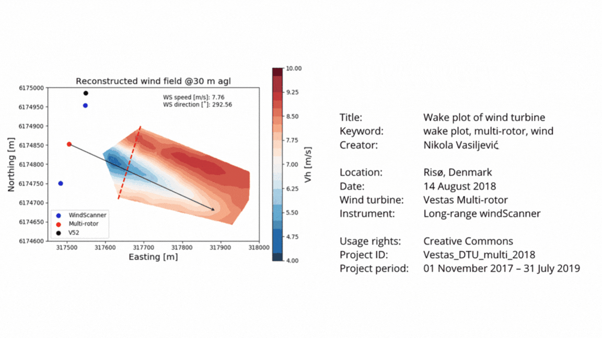

# II. Metadata 

Metadata section goes here 

<em>Adapted from "Wind Energy: Metadata" by , <a href="http://doi.org/10.5281/zenodo.3332807" target="_blank"> The Turing Way Community </a> is licensed under <a href="http://creativecommons.org/licenses/by/4.0" target="_blank"> CC BY 4.0</a></em>
 

